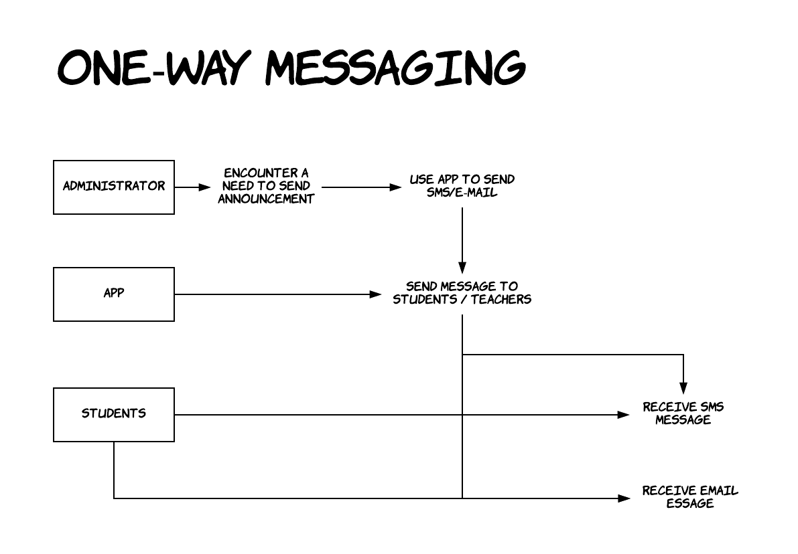

# NOTENCY

## Our Client

[Embassy English](https://www.embassyenglish.com/) is an organisation that seeks to provide teaching and resources for students learning English. They currently have schools in Australia, New Zealand, Canada, the UK and the USA.

## Our Task

Our client is looking for a web-based dashboard which would allow them to send notifications (via a service like SMS) and email announcements. The notifications are particularly critical, as they would allow the school to confirm the safety of their students in case of an emergency such as a flood. Since entering in each individual student into the system would be impractical, they would like to be able to upload student data via existing files, e.g. an excel spreadsheet containing the students' ids, names, phone numbers etc.

We set out to build a MERN stack application that would achieve theses objectives.

## Planning

We took an agile approach to organising our workflow, using trello to collect ideas and manage tasks. 

[Link to our board](https://trello.com/b/Xl2taIie/embassy-english)

## Program flow and Basic ERD

## Wireframing

We made three iterant mock designs,building on the things we liked and the features that we thought worked best for this application. Links to each design can be found on our trello board.

## NPM Packages

## How our API works

## Issues - Front-end / React

## Issues - Back-end / Node Express

This project was bootstrapped with [Create React App](https://github.com/facebookincubator/create-react-app).