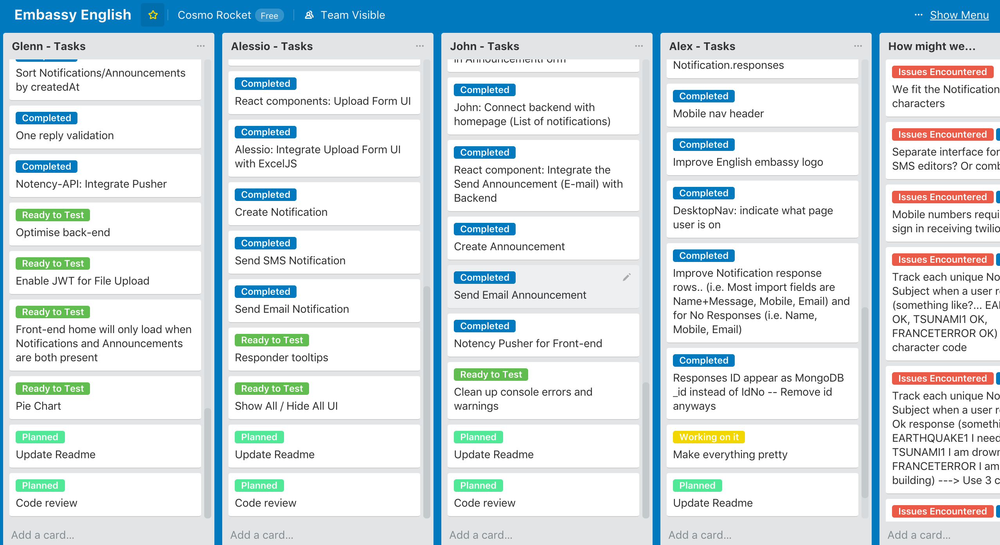
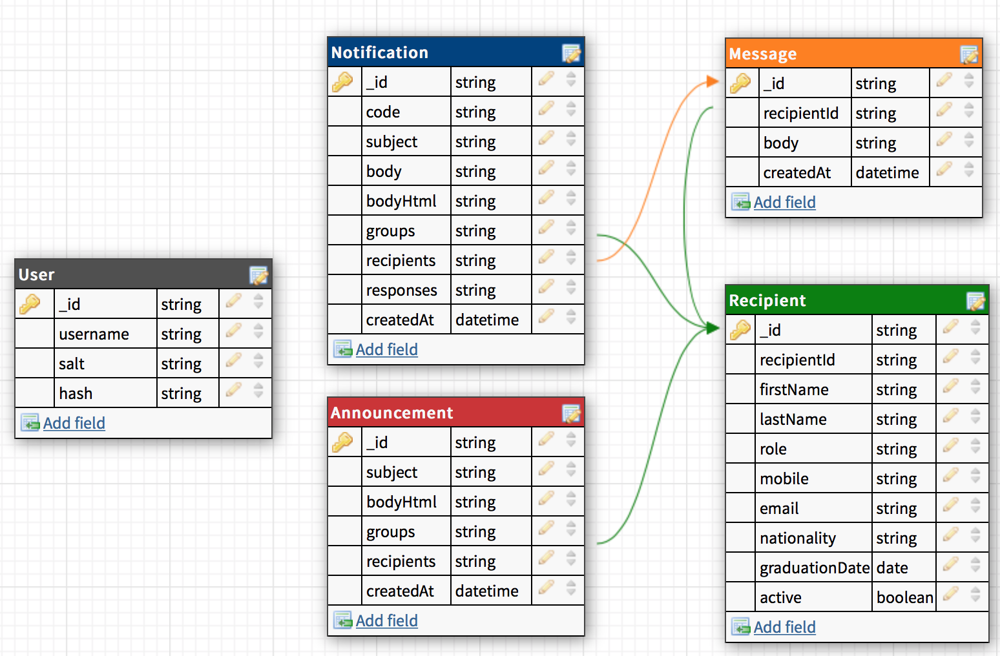

# <a id="top"></a>NOTENCY

Live at: http://notency.netlify.com/

## Contents
- **[Our Client](#OurClient)**
- **[Our Task](#OurTask)**
- **[Team Members](#TeamMembers)**
- **[Information Gathering](#InformationGathering)**
- **[Project Charter](#ProjectCharter)**
- **[Interactions With Client](#InteractionsWithClient)**
- **[Planning and Work Breakdown and Allocation](#PlanningandWorkBreakdownandAllocation)**
- **[User Stories](#UserStories)**
- **[Process Map](#ProcessMap)**
- **[Entity Relationship Diagram](#ERD)**
- **[Wireframing](#Wireframing)**
- **[Repositories](#Repositories)**
- **[Notency API](#NotencyAPI)**
- **[Our Test Driven Pipeline](#OurTestDrivenPipeline)**
- **[NPM / Yarn Packages](#NPMYarnPackages)**
- **[Client Questionaire](#ClientQuestionaire)**
- **[Post Project Review](#PostProjectReview)**

## <a id="OurClient"></a>Our Client

[Embassy English](https://www.embassyenglish.com/) is an organisation that seeks to provide teaching and resources for students learning English. They currently have schools in Australia, New Zealand, Canada, the UK and the USA.

[Back to Top](#top)

## <a id="OurTask"></a>Our Task

Our client is looking for a web-based dashboard which would allow them to send notifications (via a service like SMS) and email announcements. The notifications are particularly critical, as they would allow the school to confirm the safety of their students in case of an emergency such as a flood. Since entering in each individual student into the system would be impractical, they would like to be able to upload student data via existing files, e.g. an excel spreadsheet containing the students' ids, names, phone numbers etc.

We set out to build a MERN stack application that would achieve these objectives.

[Back to Top](#top)


## <a id="TeamMembers"></a>Team Members

- [Alessio Palumbo](github.com/alessio-palumbo)
- [Alex Farries](@github/cursande)
- [Glenn Dimaliwat](@github/Gurenax)
- [John Voon](@github/johnvoon)
    

[Back to Top](#top)

## <a id="InformationGathering"></a>Information Gathering

Before our first meeting and based on the preliminary information provided by the client about the kind of app they wanted, we prepared a list of potential issues/questions to ask of the client.

[Link to Issues/Questions to Ask the Client](https://drive.google.com/open?id=18tdyhtKnKc1liPz6Ea4KNleAcVBdb5Ua)

[Back to Top](#top)

## <a id="ProjectCharter"></a>Project Charter

Early on in the project, we prepared the Project Charter containing the problem statement, our proposed solution, the goal of the project, scope of the project, schedule/timeline and terms of the project. This client acknowledged and agreed with what we proposed and the signed document can be found here.

[Link to Project Charter](https://drive.google.com/open?id=1o0TFGbgxc2bO3Cv6jlxSUZteY7G3bll6)

## <a id="InteractionsWithClient"></a>Interactions with Client

We corresponded with the client mainly via face to face meetings and email. We kept track of these interactions including emails and meeting minutes.

[Link to all correspondence with Embassy English]()

[Back to Top](#top)

## <a id="PlanningandWorkBreakdownandAllocation"></a>Planning and Work Breakdown and Allocation

We took an agile approach to organising our workflow, using Trello heavily to collect ideas and manage tasks. We used Trello to breakdown and allocate the workload based on our app's features and components.

Whilst we prepared the wireframes, Glenn worked on the basic functionality for the backend such as sending SMS and emails. Once the wireframes were finalized, the rest of us developed the individual components needed by the application which could be reused. Once the components were in place, we assembled the various pages of the application. Finally, we connected the front end to the back end API and polished the UI and functionality.


[Link to our board](https://trello.com/b/Xl2taIie/embassy-english)



[Back to Top](#top)

## <a id="UserStories"></a>User Stories

```
I want to notify the students of an emergency so that important information and
intructions can be conveyed on a timely basis
```
```
I want to track the replies of teachers and students so I can know if they are
safe during an emergency
```
```
I want to let teachers/students of a certain nationality know if their country
has suffered a calamity/accident/terrorist attack so that only relevant parties
are communicated with
```
```
I want to send newsletters and announcements to students so I can conveniently
keep students informed of non-critical events happening in the school
```
```
I want to upload student and teacher data from a file so that I can easily keep
the database updated without manual data entry
```
```
I want to send the notifications in form of a SMS message or an Email so that
students have multiple means of receiving notifications and so that an internet
connection is not required to receive that information
```
```
I want to easily search, group, categorize and manage the recipients so I can
easily look up whether students have been added to the mailing list
```
```
I want to identify the status of the notifications delivered so that I can
resend notifications to those that have not received them.
```

[Back to Top](#top)

## <a id="ProcessMap"></a>Process Map

### One-way Messaging
One-way communication is used for sending out Announcements. These announcements do not require the recipients to respond to the message.   

    

### Two-way Messaging
Two-way communication is used for sending out Notifications. These notifications pertain to situations where the recipients need to respond to the message. 

    

[Back to Top](#top)

## <a id="ERD"></a>Entity Relationship Diagram



[Back to Top](#top)

## <a id="Wireframing"></a>Wireframing

We made three iterant mock designs, building on the things we liked and the features that we thought worked best for this application. Links to each design can be found on our trello board.


[Back to Top](#top)

## <a id="Repositories"></a>Repositories
We decided to separate the back-end repository from the front-end repository as it was an easier way to manage our branches. It also gave us a clearer perspective in finding our errors and keeping the changes under control.   

- [Link to Front-end repository](https://github.com/CosmoRocket/Notency)
- [Link to Back-end repository](https://github.com/CosmoRocket/Notency-api)


[Back to Top](#top)

## <a id="NotencyAPI"></a>Notency API

The [Notency API](https://github.com/CosmoRocket/Notency-api/) is the Node.JS back-end for Notency Front-end. Our back-end uses Express, Mongoose and other several open-source libraries. It was created with test driven development in mind while using tools such as Flow and Jest. It also uses the async/await syntax for all its routes and API calls.

Notency API makes use of Twilio for sending text messages and Mailgun for sending e-mail messages. These APIs are the foundation of our Notification and Announcement features and it completes the main essential of our app which is to have two-way communication with its customers.

### Setting up Notency API

1. Git clone https://github.com/CosmoRocket/Notency-api.git
2. Create a .env file containing the following keys in the root folder

```
JWT_SECRET =
JWT_ALGORITHM =
JWT_EXPIRES_IN =

TWILIO_ACCOUNT_SID =
TWILIO_AUTH_TOKEN =
TWILIO_NUMBER =
TWILIO_MESSAGING_SERVICE_SID =

MAILGUN_DOMAIN =
MAILGUN_API_KEY =
MAILGUN_PUB_KEY =

PUSHER_APP_ID =
PUSHER_KEY =
PUSHER_SECRET =
PUSHER_CLUSTER =

MONGO_URI =
MONGO_TEST_URI =
```

[Back to Top](#top)

## <a id="OurTestDrivenPipeline"></a>Our Test Driven Pipeline

Notency API is built with 100% Test Driven Development coverage while the Notency Front-end is thoroughly tested across multiple mobile devices, desktop, and multiple browsers.

1. Run syntax checker

```
yarn flow
```

2. Ensure that there are no errors in Flow    


2. Run test server

```
yarn test
```

3. Run tests

```
yarn jest
```

4. Ensure that there are no errors in Jest    
    

[Back to Top](#top)

## Routes for Notency API

### User

`GET /users`

* Get a list of all users

`GET /users/:id`

* Get a specific user

`POST /users`

* Create a new user
* Request Parameters: `username`, `password`

`DELETE /users/:id`

* Delete a specific user

### Auth

`POST /auth/register`

* Register as a new user
* Request Parameters: `username`, `password`

`POST /auth`

* Sign in as an existing user
* Request Parameters: `username`, `password`

### Recipient

`POST /recipients/search`

* Search for a Recipient using filters
* Request Parameters: `nationality`, `role`, `graduationDate`

```javascript
e.g.
{
  "nationality": "Australia",
  "role": "Student",
  "graduationDate": "31/12/2018",
  "active": true
}
```

`GET /recipients/active`

* Get a list of all active recipients

`GET /recipients`

* Get a list of all recipients

`GET /recipients`

* Get a specific recipient

`POST /recipients`

* Create a new recipient
* Request Parameters: `idNo`, `firstName`, `lastName`, `role`, `mobile`, `email`, `nationality`, `graduationDate`

`PATCH /recipients/:id`

* Update a recipient
* Request Parameters: `idNo`, `firstName`, `lastName`, `role`, `mobile`, `email`, `nationality`, `graduationDate`

`DELETE /recipients/:id`

* Delete a specific recipient

### Notification

`GET /notifications/latest/:limit`

* Get a number of latest notifications
* Request Parameter: `limit`

```javascript
e.g.
/notifications/latest/5
```

`GET /notifications`

* Get a list of all notifications

`GET /notifications`

* Get a specific notification

`POST /notifications`

* Create a new notification
* Request Parameters: `code`, `subject`, `body`, `bodyHtml`, `groups`, `recipients`, `responses`, `createdAt`

`PATCH /notifications/:id`

* Update a notification
* Request Parameters: `code`, `subject`, `body`, `bodyHtml`, `groups`, `recipients`, `responses`, `createdAt`

`DELETE /notifications/:id`

* Delete a specific notification

### Announcement

`GET /announcements/latest/:limit`

* Get a number of latest announcements
* Request Parameter: `limit`

```javascript
e.g.
/announcements/latest/5
```

`GET /announcements`

* Get a list of all announcements

`GET /announcements`

* Get a specific announcement

`POST /announcements`

* Create a new announcement
* Request Parameters: `subject`, `bodyHtml`, `groups`, `recipients`, `createdAt`

`PATCH /announcements/:id`

* Update a announcement
* Request Parameters: `subject`, `bodyHtml`, `groups`, `recipients`, ` createdAt``responses `, `createdAt`

`DELETE /announcements/:id`

* Delete a specific announcement

### Message

`GET /messages`

* Get a list of all messages

`GET /messages`

* Get a specific message

`POST /messages`

* Create a new message
* Request Parameters: `sender`, `body`, `createdAt`

`PATCH /messages/:id`

* Update a message
* Request Parameters: `sender`, `body`, `createdAt`

`DELETE /messages/:id`

* Delete a specific message

### SMS

`POST /sms/receive`

* Receive SMS messages and store them in the Notification responses
* Request Parameters: `From`, `Body`

```javascript
e.g.
{
  From: '+61444888000',
  Body: 'EQ1 OK'
}
```

`POST /sms/send`

* Send SMS messages to a single mobile number
* Request Parameters: `recipient`, `message`

```javascript
e.g.
{
  recipient: '+61444555555',
  message: 'This is a test notification!'
}
```

`POST /sms/groupSend`

* Send SMS messages to multiple mobile numbers
* Request Parameters: `recipients`, `message`

```javascript
e.g.
{
  recipients: ['+61444555555', '+61444555552', '+61444555553'],
  message: 'This is a test notification!'
}
```

### E-mail

`POST /email/receive`

* Receive E-mail messages and store them in the Notification responses
* Request Parameters: `sender`, `subject`, `stripped-text`

```javascript
e.g.
{
  sender: 'somone@example.com',
  subject: 'Re: Hello',
  'stripped-text': 'EQ1 OK'
}
```

`POST /email/send`

* Send E-mail messages to a single or several e-mail addresses
* Request Parameters: `recipients`, `subject`, `text`, `html`

```javascript
e.g.
{
  recipients: ["someone@example.com"],
  subject: "Hello",
  text: "Testing some Mailgun awesomness!",
  html: "<h1>Testing some Mailgun awesomness!</h1>"
}
```

### File Upload

`POST /upload`

* Upload a CSV file and store data as Recipients
* Request Parameters: `file`

[Back to Top](#top)

## <a id="NPMYarnPackages"></a>NPM / Yarn Packages

* mongoose
* express - Back end framework
* react - Front end view library
* body-parser - For parsing responses
* nodemon
* dotenv - For storing application environment variables
* axios - For making API requests from the front end
* twilio - Service we used for sending SMS and tracking responses
* mailgun / nodemailer - Service we used for sending emails and tracking responses
* exceljs
* nodemailer-mailgun-transport - Integrates nodemailer and mailgun for making sending emails with attachments easier
* react-draft-wysiwyg - Editor for composing emails.
* formik - Higher order component for storing and handling form state
* yup - Used for front end form validations
* immutable.js
* draft.js -
* flow - Type checking tool
* jest - Testing library
* multer - Middleware for processing FormData object and adding the req.file attribute
* moment - Formatting dates
* ramda - Library of higher order functions with emphasis on functional programming concepts

[Back to Top](#top)

## <a id="ClientQuestionaire"></a>Client Questionnaire

We prepared a questionnaire for the client to ascertain the satisfaction with our product and service.

[Back to Top](#top)

## <a id="PostProjectReview"></a>Post Project Review

### Summary

This project presented us with interesting features to implement such as sending SMS and tracking responses and therefore was a very valuable learning opportunity. Doing the project for a real client helped us train soft skills such as communication, planning, scoping to a minimum viable product, time management, getting feedback, etc.

The scope of the project was perfect for the time allowed whilst challenging at the same time.        

### Communication with the client

We managed to communicate regularly with the client by email and meetings to get instructions and confirmation as we went along. We were very fortunate in that our client was very responsive to our questions and emails, which made the whole process a lot smoother for us. 


### Collaboration as a team

We worked well together as a team and as a result were on schedule in completing the prototype of the application. We had regular discussions regarding the design, wireframes, approach, how to go about implementing features, etc. In doing so, we avoided replicating efforts.

We pair-programmed when appropriate which helped each other detect bugs in the program.

We used git and github mostly without much trouble, merging work as features were completed. There was just one time where we had trouble syncing our work due to a delayed pull but that was eventually resolved.


### Introducing new libraries

At one stage, one of the group members introduced a new library called Formik to manage form state in React which resulted in unfamiliar code being added to important parts of the codebase.

Introducing libraries made life easier on the one hand but was a challenge on the other hand especially when other team members tried to read and introduce other features on top of the existing code.

In these circumstances, it was important to have the person who introduced the new library to be involved in writing the new code by pair programming for example and to explain how the new library works.


### Use of the Chrome developer tools

One of the more time consuming and frustrating features to implement was dealing with all the edge cases of filtering recipients by group such as role, nationality, graduation date on the front end. Using the Chrome developer tools was extremely helpful in tracking the props and state changes in the app whilst developing this feature. So often, this was better than littering `console.log` statements throughout the app.


### Tracking SMS responses

A key feature of our app was being able to track SMS responses. One of the challenges that came up during group discussions was how to associate SMS responses coming back with a particular notification given that SMS responses do not store any application state.

We considered two possible solutions:

1. Generate a short unique code for the student to type in which would link to a notification sent out

2. Have multiple numbers, where a notification is assigned a number and the numbers are rotated through as new notifications are created. The Sent number can then easily be connected to a notification.

We chose the first option as we could only test with one number with the trial TWilio account, though left open the possibility of adding more numbers through Twilio.


### Email Attachments

Getting email attachments to work was time consuming especially as we did not have a clear idea of what was involved in implementing the functionality. In the absence of clear guidance, documentation and tutorials, we had to take a step back and think through the whole process ourselves before implementing the feature.

There are 3 main steps in sending an email with attachments: Submitting the file, saving the file to the app and attaching it in the email. After extensive research, we submitted the attachment using a FormData object and processed that on the back end using Multer. Multer would save that file to a temporary folder in the app, which could then be attached to the email.


### Deleting Recipients vs Activating/Deactivating Recipients

The list of students/teachers at Embassy English gets updated quite frequently as new students enroll and existing students graduate on a weekly basis.
One challenging decision we faced related to this was whether to totally replace all recipients in the database from the excel file or keep all users on the database and just activate/deactivate users.

Clarity came midway through the project when we realized the implications of deleting recipients from the database. This would mean some notifications would not have IDs without corresponding recipients, as they would have been deleted. So this ruled out the option of deleting recipients.

However, if we were to let the list of recipients grow, students who had graduated or dropped out would still receive messages. The solution we decided to implement that made the most sense was to have a boolean attribute `active`, which would be `true` if the student was still on the list and `false` if not. On the back-end, we would need to have a route such as `/recipients/active` which would run a query to retrieve only "active" recipients.

[Back to Top](#top)
